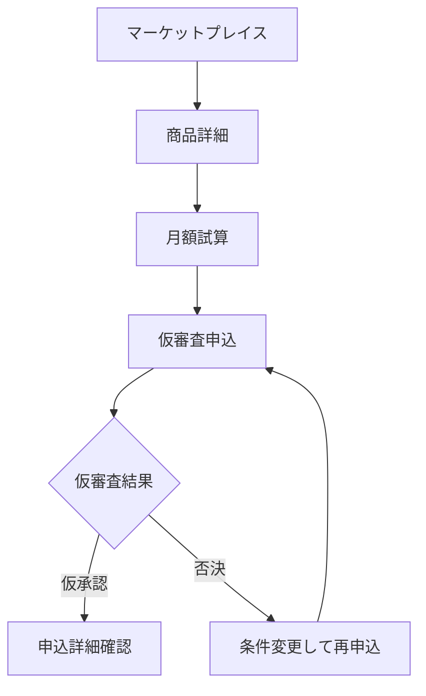
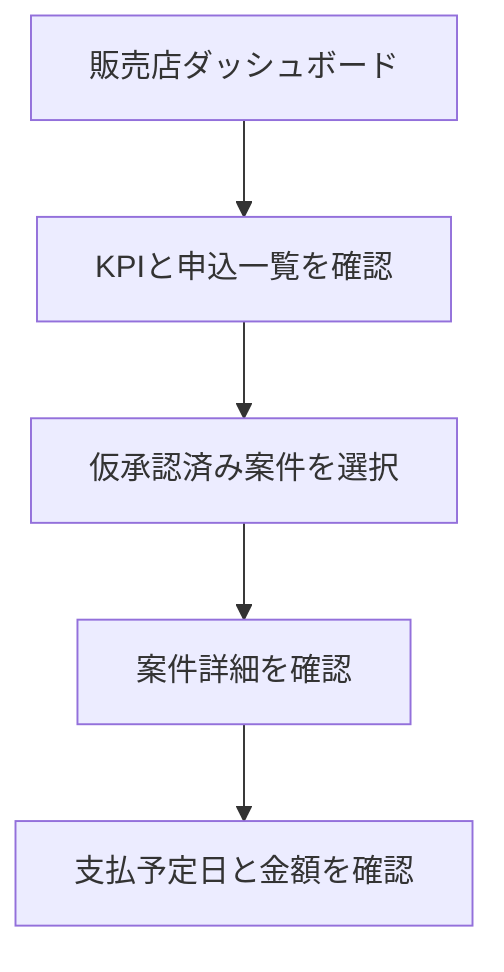
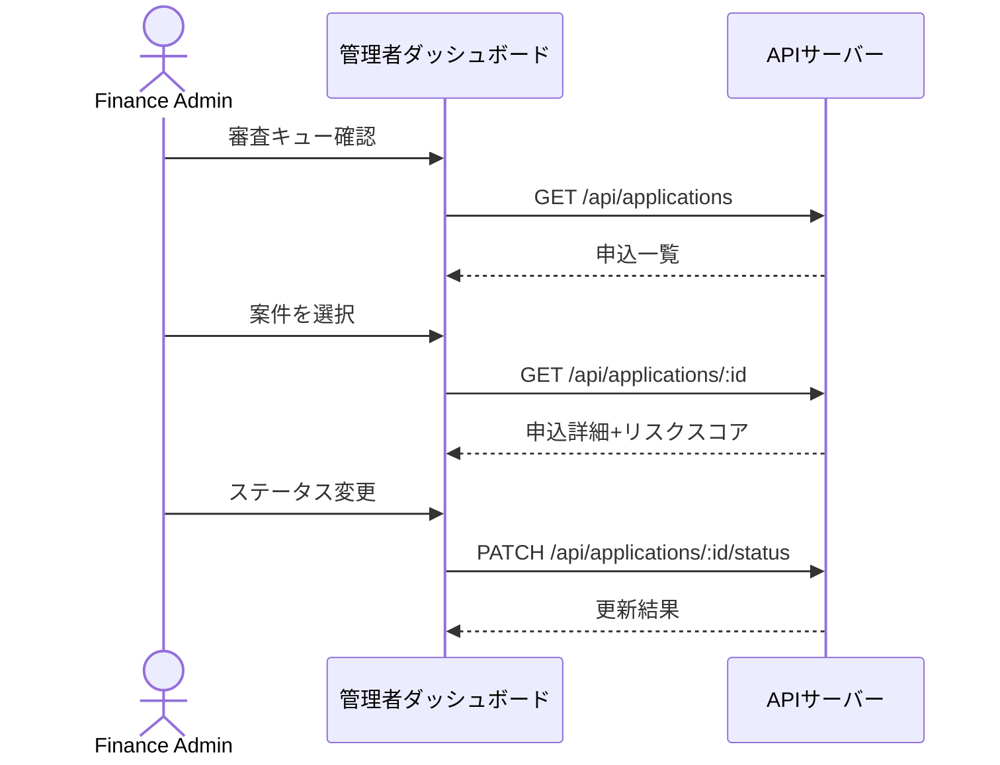

# ユーザーフロー設計

## 主要フロー一覧

| フローID | フロー名 | 対象ロール | 開始条件 | 完了条件 |
|---|---|---|---|---|
| FLOW-001 | 買い手企業フロー | Buyer | マーケットプレイス閲覧 | 仮審査結果確認 |
| FLOW-002 | 販売店フロー | Merchant | ダッシュボード確認 | 支払予定確認 |
| FLOW-003 | ファイナンス管理者フロー | Finance Admin | 審査キュー確認 | ステータス変更完了 |

## FLOW-001: 買い手企業フロー

```text
1. ロールを「Buyer」に切替
2. /marketplace で商品一覧を閲覧
3. 商品カードをクリックして詳細画面へ
4. 試算条件を入力（期間・頭金・保険等）
5. 「月額を試算する」で見積取得
6. 「仮審査に進む」で申込画面へ
7. 法人情報を入力（またはサンプル入力）
8. 「仮審査を申し込む」で結果表示
9. 「申込詳細を見る」でタイムライン確認
```



## FLOW-002: 販売店フロー

```text
1. ロールを「Merchant」に切替
2. /merchant/dashboard でKPIと申込一覧を確認
3. 仮承認済み案件をクリックして詳細確認
4. 契約済み案件の支払予定日と金額を確認
```



## FLOW-003: ファイナンス管理者フロー

```text
1. ロールを「Finance Admin」に切替
2. /admin/dashboard で審査キューを確認
3. 案件を開いてリスクスコアを確認
4. メモを入力し「本審査へ進める」でステータス変更
5. APIコール確認パネルでリクエスト/レスポンスを確認
```



## 例外フロー

| 条件 | 表示/挙動 | 復旧方法 |
|---|---|---|
| アセットなし | 空状態を表示 | マーケットプレイスに戻る |
| 仮審査否決 | 否決理由を表示 | 条件変更して再申込 |
| API失敗 | エラー通知を表示 | 再試行 |
